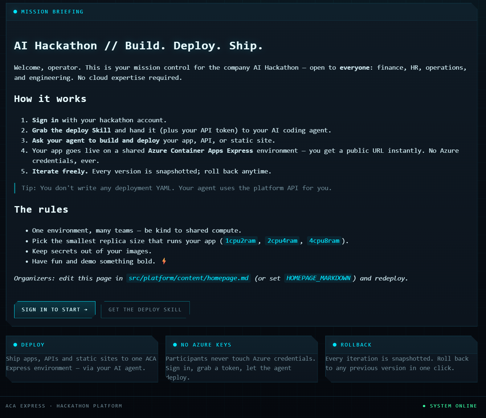
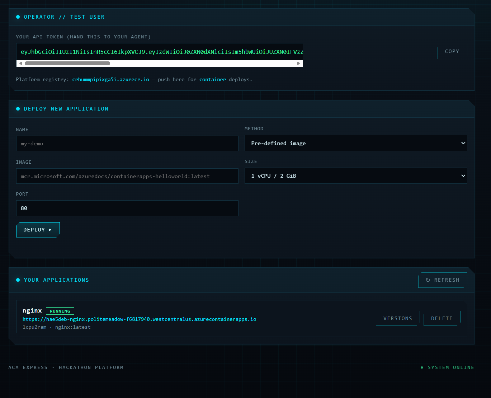

# ACA Express Hackathon Platform

A one-command [`azd`](https://learn.microsoft.com/azure/developer/azure-developer-cli/)
template that stands up a **hackathon compute platform** built around **Azure Container
Apps Express**. Any company can run an AI hackathon where participants from finance, HR,
operations and engineering deploy apps, APIs and static sites into **one shared ACA
Express environment** — using their **AI agent** and a **Skill**, and **without ever
holding Azure credentials**.

The control plane (the platform app + Keycloak) runs on a **standard** ACA environment;
**participant apps** are provisioned into a dedicated **Express** environment. See
[why two environments](#why-two-environments) below.

## Screenshots

**Hackathon homepage** — the public mission-briefing landing page participants see:



**Participant management UI** — where each operator grabs their API token and deploys,
lists, versions and rolls back their apps:



```
                         ┌───────────────────────────────────────────────┐
   participant browser ──►  Hackathon Platform  (standard ACA app)        │
                         │  • public HUD homepage (markdown)              │
   AI agent + SKILL  ───►│  • EasyAuth login (Keycloak custom OIDC)       │
     (Bearer token)      │  • deployment API  ──► ARM (managed identity) │
                         └───────────────┬───────────────────────────────┘
                                         │ creates / updates / rolls back
                         ┌───────────────▼───────────────────────────────┐
                         │        ACA **Express** environment             │
                         │              participant apps                  │
                         └────────────────────────────────────────────────┘

   standard ACA env:  platform app  ·  Keycloak            (shared registry)
```

## Why two environments

ACA **Express** is the compute tier for participant apps, but it has two constraints that
make it unsuitable for hosting the control plane:

- **`azd deploy` fails on Express** — Express rejects the `revisionSuffix` that azd sends
  (`ExpressEnvironmentFeatureNotSupported`), so an azd-deployed custom image can't be
  shipped there.
- Express also has a slower first-boot provisioning path that races azd/ARM timeouts.

So the **platform app and Keycloak run on a standard ACA environment** (normal ACA Bicep,
`azd deploy` works), while a separate **Express** environment
(`Microsoft.App/managedEnvironments@2026-03-02-preview`, `environmentMode: 'Express'`) is
the **target** the platform provisions participant apps into. Keycloak is temporary anyway
(replaced by Entra ID — see [docs/keycloak-to-entraid.md](docs/keycloak-to-entraid.md)).

## What you get

- **Public, themed homepage** (HUD "control panel" theme) with organizer instructions in
  **Markdown**, plus one-click staging of the agent **Skill**.
- **Login** via ACA **EasyAuth** backed by Keycloak (custom OIDC) — swappable for Entra ID
  (see [docs/keycloak-to-entraid.md](docs/keycloak-to-entraid.md)).
- **Dashboard** listing the signed-in user's apps, status, live URLs, and a personal
  **API token** to hand to their agent.
- **Deployment API** to create apps by `name`, `method` (`image` | `container`) and
  replica `size` (`1cpu2ram` | `2cpu4ram` | `4cpu8ram`).
- **Version snapshots + rollback** — every deploy is an ACA revision you can restore.
- **Agent Skill** (`skills/aca-hackathon-deploy/SKILL.md`) so AI agents deploy on the
  user's behalf with just the API token.

## Repository layout

| Path | Purpose |
|------|---------|
| `azure.yaml` | azd service + hooks definition (single `platform` service). |
| `infra/main.bicep` | Subscription-scoped entry point; wires RG, registry, both envs, Keycloak, platform. |
| `infra/modules/environment-standard.bicep` | **Standard** ACA environment + Log Analytics (hosts the platform app + Keycloak). |
| `infra/modules/express-environment.bicep` | **Express** environment (`environmentMode: 'Express'`, api `2026-03-02-preview`) — participant-app target. |
| `infra/modules/registry.bicep` | Shared Azure Container Registry (admin enabled). |
| `infra/modules/keycloak.bicep` | Self-hosted Keycloak OIDC provider (standard env). |
| `infra/modules/platform.bicep` | The platform app on the standard env; provisions participant apps into the Express env. |
| `hooks/` | preprovision (generate secrets) + postprovision (configure Keycloak). |
| `src/platform/` | The Express app: UI, deployment API, OIDC, ACA provisioning wrapper. |
| `skills/aca-hackathon-deploy/` | The agent Skill (canonical copy). |
| `scripts/create-provisioner-sp.*` | Helper to create the provisioning service principal. |
| `docs/` | Architecture, quickstart, troubleshooting, Keycloak→Entra switch. |

## Quickstart

Prerequisites: [azd](https://learn.microsoft.com/azure/developer/azure-developer-cli/install-azd),
Docker, `az login`, and an **Entra-backed** account (ACA Express requires it).
ACA Express preview is available only in **West Central US** and **East Asia**.

```bash
azd env new my-hackathon
azd up                                           # pick location: westcentralus or eastasia
```

`azd up` creates a **user-assigned managed identity** for provisioning by default (needs
rights to create a role assignment on the RG). When it finishes, open the printed
**PLATFORM_URI** and sign in with `testuser` / `Password123!`. Full walkthrough:
[docs/quickstart.md](docs/quickstart.md).

## "Can the platform use Managed Identity to provision apps?" — answered (yes)

The brief asked whether **managed identity (MI)** is a workable, easy way for the platform
to provision apps on users' behalf. **Yes — and it's now the default.**

- **On ACA Express: No.** Express apps **cannot carry a managed identity** (system- or
  user-assigned) — `ExpressEnvironmentFeatureNotSupported`.
- **On a standard ACA environment: Yes.** Since the control plane can't run on Express
  anyway (`azd deploy` rejects it — see [Why two environments](#why-two-environments)), the
  platform runs on a **standard** env and carries a **user-assigned managed identity** with
  `Contributor` on the RG. `lib/aca.js` uses `ManagedIdentityCredential` to call ARM and
  create participant apps in the Express env. The caller's identity is unrelated to the
  target env being Express, so MI provisions Express apps fine.

A **service principal** remains as an override (`AZURE_PROVISION_*`) for tenants where you
can't create a role assignment. Details:
[docs/architecture.md](docs/architecture.md#managed-identity-vs-service-principal).

## Docs

- [Architecture](docs/architecture.md) — components, data flow, EasyAuth login, MI vs SP.
- [Quickstart](docs/quickstart.md) — deploy, log in, deploy an app, roll back.
- [Troubleshooting](docs/troubleshooting.md) — common failures and fixes.
- [Keycloak → Entra ID](docs/keycloak-to-entraid.md) — switch the identity provider.

## Local development

```bash
cd src/platform
npm install
PORT=8099 node server.js       # homepage + skill work with no Azure wiring
```

Login and provisioning are disabled locally unless you set the corresponding env vars.
EasyAuth only exists in Azure, so for local login set the app-level OIDC fallback
(`EASYAUTH_ENABLED=false` + `OIDC_*`); provisioning needs `AZURE_PROVISION_*` or a managed
identity. The app degrades gracefully without them.
